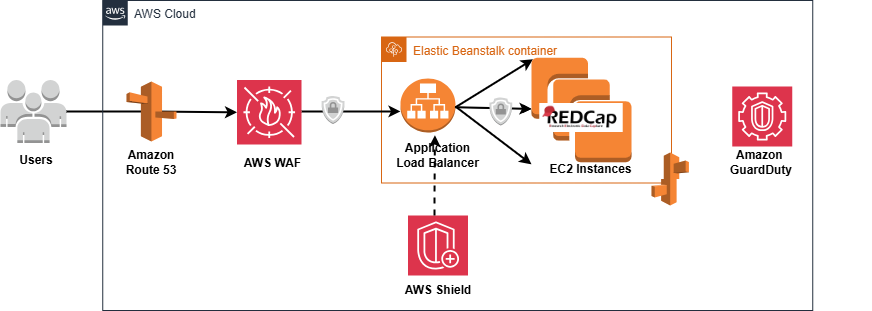
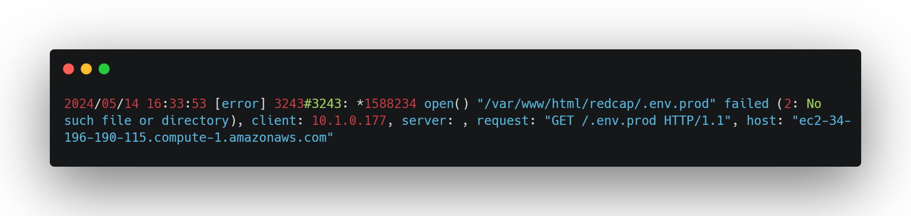

# Securing REDCap on AWS: How I Stopped DDoS Attacks with AWS WAF

This repository documents the implementation of robust security measures for securing a REDCap web application deployed on AWS. Specifically, it covers how to mitigate Distributed Denial of Service (DDoS) attacks and protect against OWASP Top 10 web vulnerabilities using AWS Web Application Firewall (WAF) and Fortinet Managed Rules.

## Project Overview

After deploying REDCap on AWS, I faced a significant security challenge: a DDoS attack. This project describes how AWS WAF, supplemented with Fortinet Managed Rules, was employed to enhance security, reduce malicious activity, and stabilize the application environment.

## Identifying the Problem

The REDCap deployment quickly became targeted by attackers, evident through:
- **High HTTP 4xx error rates** causing fluctuating server health.
  
- **Frequent access attempts** for sensitive or non-existent files.
  
- **404 errors** for configuration files indicating malicious probing.
  

These issues were logged through AWS Elastic Beanstalk and CloudWatch logs.

## Security Solution

### AWS WAF Implementation

AWS WAF served as the primary defense by inspecting traffic through a Web Access Control List (Web ACL) attached to the CloudFront distribution for REDCap.

#### Custom Rules
- Prevented SQL Injection (SQLi) and Cross-Site Scripting (XSS).
- Controlled unauthorized access attempts.

#### Fortinet Managed Rules
- Preconfigured rules targeting OWASP Top 10 vulnerabilities.
- Efficiently addressed SQL injection, XSS, and broken access controls.

**Recommendation:** Subscribe to managed rules through AWS Marketplace to streamline security maintenance.

### Additional Security Layers
- **AWS Shield:** Mitigated volumetric DDoS traffic.
- **AWS GuardDuty:** Monitored suspicious activities in real-time.
- **IAM Best Practices:** Enforced least privilege access policies.

### Data Security
Ensured encryption at multiple levels:
- **In Transit:** HTTPS enforced.
- **At Rest:** Amazon S3 server-side encryption.

## Security Architecture
AWS WAF positioned between users and REDCap acted as the primary security gatekeeper. Traffic passing through WAF was vetted, malicious requests blocked, and legitimate requests allowed, stabilizing and securing the REDCap environment.

 

## Results and Observations
Since implementation:
- **Improved Security:** Reduction in SQLi, XSS, and unauthorized access attempts.
- **Stabilized Environment:** Reduced HTTP 4xx errors and increased application stability.
- **Cost Efficiency:** Optimized rule management to balance security and operational costs.
  

AWS WAF & Shield dashboards showing the effectiveness of implemented security measures.

## Conclusion
Integrating AWS WAF with Fortinet Managed Rules substantially improved the security posture of the REDCap deployment, effectively mitigating DDoS attacks and OWASP Top 10 vulnerabilities.

## References
- [Deploying REDCap on AWS: A Comprehensive Guide](#)
- [GitHub Repository for REDCap on AWS](#)
- [OWASP Top 10](https://owasp.org/www-project-top-ten/)
- [AWS WAF Documentation](https://docs.aws.amazon.com/waf/latest/developerguide/)
- [AWS GuardDuty](https://aws.amazon.com/guardduty/)
- [AWS Marketplace](https://aws.amazon.com/marketplace/)

